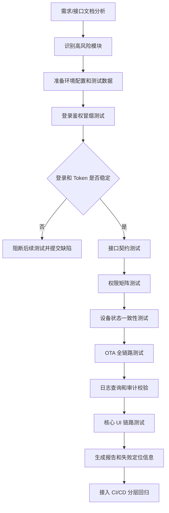
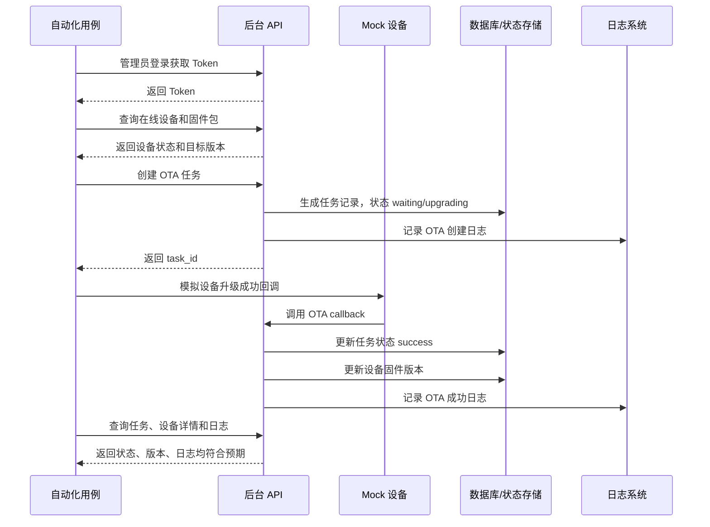
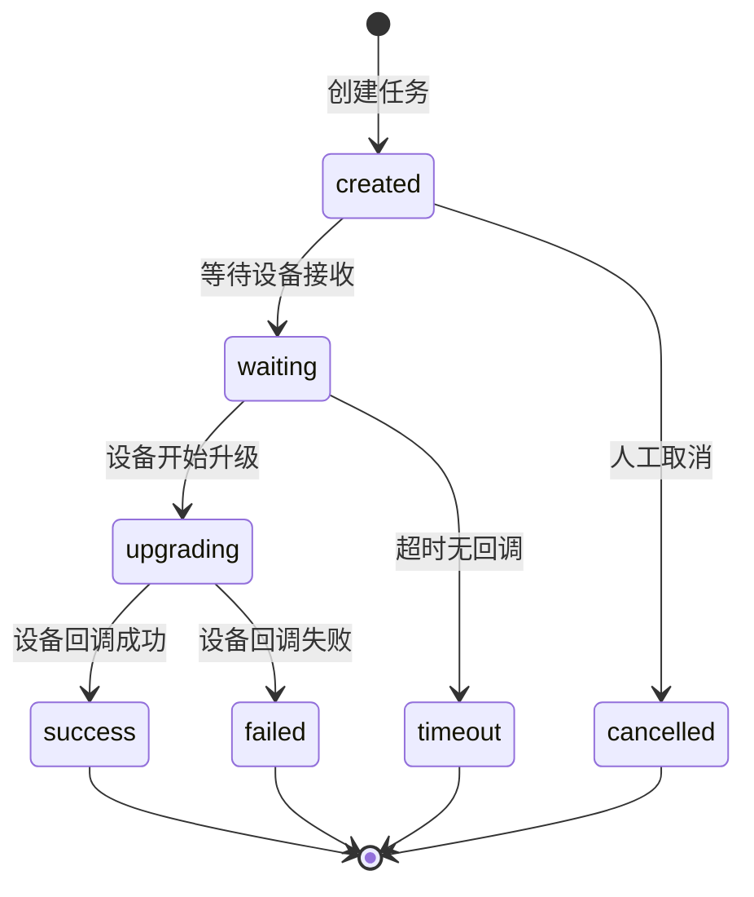
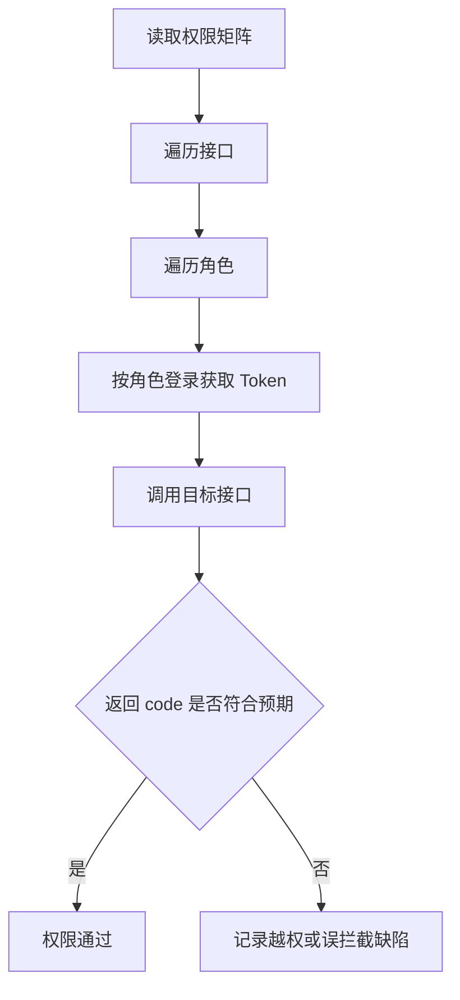
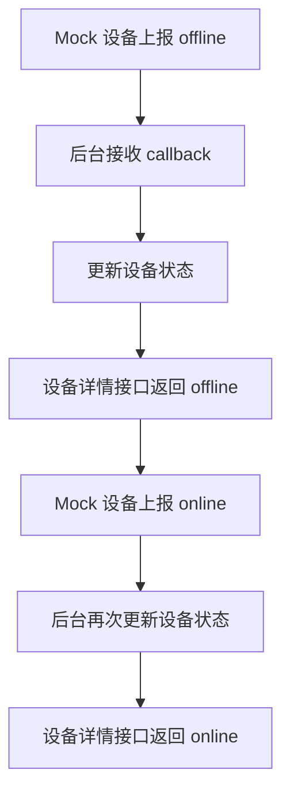
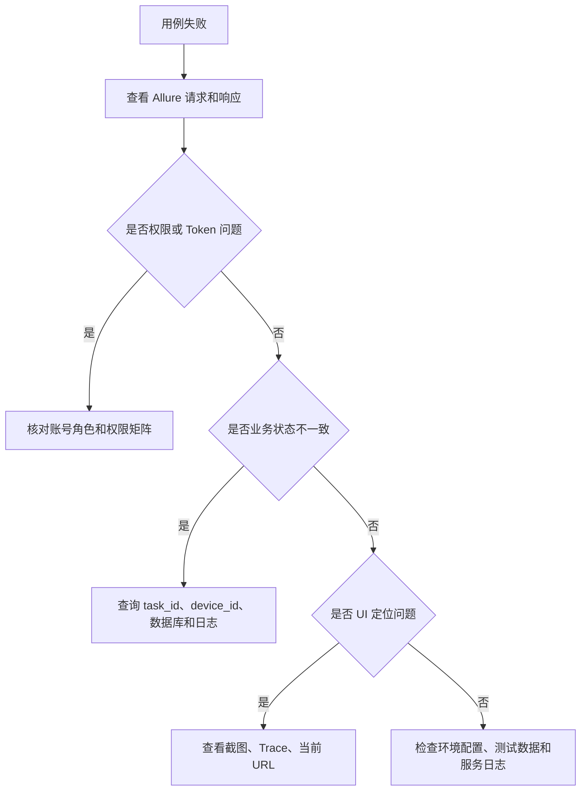
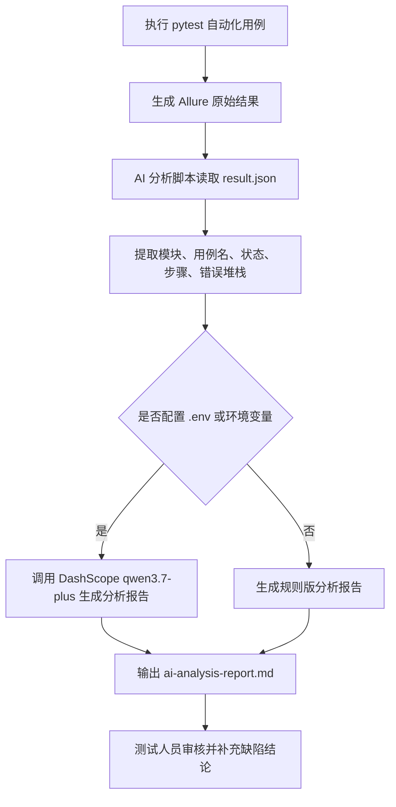

# X-SENSE 后台和服务端自动化测试技术方案

## 1. 方案概述

本方案面向 IoT 后台管理系统，重点覆盖登录鉴权、权限控制、设备管理、OTA 固件升级、日志查询和数据一致性等服务端核心能力。方案目标不是一次性覆盖所有后台页面，也不是写完整业务系统代码，而是建立一套可落地、可维护、能持续回归的后台和服务端自动化测试体系。

整体思路如下：

```text
接口自动化为主，UI 自动化为辅；
优先覆盖高风险、高频、强依赖链路；
通过 Mock 设备降低真实 IoT 设备依赖；
通过接口、日志、数据库和报告附件提升失败定位效率；
通过配置化数据和分层封装降低维护成本。
```

核心取舍是：后台系统真正的风险通常不在页面样式，而在接口权限、异步状态、设备回调、数据一致性和日志可追踪性。因此本方案优先投入接口自动化、权限矩阵、OTA 全链路和数据一致性校验，UI 自动化只覆盖后台真实操作主流程。

## 2. 风险识别与优先级

自动化测试不应平均覆盖所有模块，而应先识别高风险区域。对于 IoT 后台系统，我会从以下维度判断优先级：

| 风险维度 | 判断标准 | 示例 |
|---|---|---|
| 业务影响范围 | 出错后是否影响大量用户或设备 | OTA 错误下发、批量任务异常 |
| 安全风险 | 是否可能造成越权、数据泄露或误操作 | 普通用户调用管理员接口 |
| 数据一致性 | 是否涉及接口、数据库、设备状态、日志多方同步 | OTA 成功但设备版本未更新 |
| 使用频率 | 是否是后台人员高频操作 | 设备列表、日志查询、筛选分页 |
| 系统依赖复杂度 | 是否依赖异步任务、设备回调、第三方服务 | 设备状态上报、OTA 回调 |
| 自动化收益 | 人工回归是否重复、耗时或容易漏测 | 多角色权限矩阵、异常参数组合 |

基于以上维度，建议优先级如下：

| 优先级 | 模块/场景 | 排序理由 |
|---|---|---|
| P0 | 登录鉴权 | 所有接口和后台操作都依赖 Token，入口不稳定会阻断后续测试 |
| P0 | 权限控制 | 后台安全风险高，必须防止前端隐藏按钮但后端未鉴权 |
| P0 | OTA 固件升级 | 直接影响 IoT 设备，涉及任务、设备、固件版本、日志和回调 |
| P0 | 设备管理 | 设备在线/离线、详情和版本是 IoT 后台基础数据 |
| P1 | 日志查询 | 故障定位依赖日志，需要验证按设备、时间、关键字查询是否可靠 |
| P1 | 数据查询/分页/导出 | 后台高频使用，适合参数化自动化覆盖 |
| P2 | 内容/运营配置和页面细节 | 业务风险相对较低，可在核心链路稳定后逐步补充 |

## 3. 测试分层设计

测试分层的目标是让不同风险使用不同成本覆盖，避免一开始投入大量不稳定的 UI 自动化。

| 层级 | 测试内容 | 目标 |
|---|---|---|
| L1 接口冒烟测试 | 登录、设备列表、设备详情、日志查询、OTA 查询 | 快速判断环境是否可用 |
| L2 接口契约测试 | HTTP 状态码、业务 code、字段完整性、字段类型、分页参数 | 发现接口变更和参数校验问题 |
| L3 权限与安全测试 | admin/operator/viewer/guest 多角色权限矩阵 | 发现越权访问、误拦截、Token 缺失/过期问题 |
| L4 业务流程测试 | OTA 创建、下发、设备回调、任务状态更新 | 验证多个接口串联后的真实业务链路 |
| L5 数据一致性测试 | 接口返回、设备状态、日志记录、数据库记录 | 验证后台状态是否真正落库和可追踪 |
| L6 UI 核心链路测试 | 登录后台、进入设备页、创建 OTA、查询日志 | 验证真实用户操作路径可用 |

整体执行路线如下：



## 4. 技术选型与落地顺序

| 能力 | 技术选型 | 落地阶段 | 选择理由 |
|---|---|---|---|
| 接口自动化 | Python + pytest + requests | 第一阶段 | 执行快、断言直接、适合高频回归 |
| 数据驱动 | YAML/JSON | 第一阶段 | 账号、设备、固件包、权限矩阵可配置，测试人员不必改代码 |
| 报告能力 | Allure | 第二阶段 | 支持步骤、附件、请求响应、截图和历史趋势 |
| 数据库校验 | pymysql/SQLAlchemy | 第二阶段 | OTA、设备、日志等关键流程需要核对落库状态 |
| Mock 设备 | FastAPI | 第二阶段 | 稳定模拟设备上线、离线、升级成功、升级失败和日志上报 |
| UI 自动化 | Playwright | 第三阶段 | 自动等待能力强，适合覆盖后台核心操作链路 |
| CI/CD | Jenkins/GitLab CI | 第三阶段 | 支持冒烟、每日回归、发版前回归分层执行 |

落地顺序建议：

1. 第一阶段：搭建接口自动化框架，覆盖登录、设备列表、日志查询和 OTA 查询等冒烟场景。
2. 第二阶段：补充权限矩阵、异常参数、OTA 全链路、Mock 设备和数据一致性校验。
3. 第三阶段：接入 Allure 报告、核心 UI 自动化和 CI/CD 流水线，形成稳定回归能力。

## 5. 框架设计

框架采用分层结构，避免用例中直接拼接大量接口路径和测试数据。

```text
config/       多环境配置，例如 dev/test/pre
data/         账号、设备、OTA、权限矩阵等测试数据
common/       HTTP 客户端、断言、日志、等待、报告附件、数据库工具
services/     登录、设备、OTA、日志、权限等业务接口封装
testcases/    接口、权限、业务流程和数据一致性用例
ui_cases/     Playwright UI 核心链路用例
mock_server/  Mock 设备服务，模拟设备回调和日志上报
reports/      Allure 测试结果和报告
```

这种结构的好处是：

1. 用例层只表达测试逻辑，接口路径变化时优先修改 service 层。
2. 环境地址、账号、设备、固件包、权限矩阵配置化，方便多人维护。
3. 接口请求、断言、日志、报告附件统一封装，减少重复代码。
4. Mock 设备能力独立维护，可以稳定覆盖真实设备难以制造的异常场景。

## 6. 重点模块：OTA 自动化测试设计

我选择 OTA 固件升级作为重点展开模块。原因是 OTA 是 IoT 后台中风险最高的链路之一，既涉及服务端接口，也涉及设备状态、固件版本、异步任务、设备回调、日志记录和数据一致性。

### 6.1 OTA 正常流程



### 6.2 OTA 状态流转



### 6.3 OTA 核心用例

| 用例编号 | 场景 | 前置条件 | 执行动作 | 预期结果 | 优先级 |
|---|---|---|---|---|---|
| OTA_001 | 正常创建 OTA 任务 | admin 登录、设备在线、固件合法 | 创建 OTA 任务 | 返回成功，生成任务记录 | P0 |
| OTA_002 | 只读用户创建 OTA | viewer 登录 | 调用创建 OTA 接口 | 返回 403，不生成任务 | P0 |
| OTA_003 | 离线设备升级 | 设备 offline | 创建 OTA 任务 | 返回失败，提示设备不可升级 | P0 |
| OTA_004 | 重复升级同版本 | 当前版本等于目标版本 | 创建 OTA 任务 | 系统拒绝重复升级 | P1 |
| OTA_005 | 固件版本回退 | 目标版本低于当前版本 | 创建 OTA 任务 | 系统拒绝或提示风险 | P1 |
| OTA_006 | OTA 成功回调 | 任务已创建 | Mock 设备回调 success | 任务 success，设备版本更新，日志存在 | P0 |
| OTA_007 | OTA 失败回调 | 任务已创建 | Mock 设备回调 failed | 任务 failed，失败原因写入日志 | P0 |
| OTA_008 | 设备长时间无回调 | 任务已创建 | 不发送回调 | 任务 timeout，日志可追踪 | P1 |
| OTA_009 | 批量升级 | 多设备在线 | 批量创建 OTA | 每台设备有独立任务状态 | P1 |
| OTA_010 | 固件包不存在 | firmware_id 非法 | 创建 OTA 任务 | 返回参数错误 | P1 |
| OTA_011 | Token 过期 | 使用非法 Token | 创建 OTA 任务 | 返回 401 | P0 |
| OTA_012 | OTA 日志校验 | 任务已完成 | 查询日志 | 日志包含 task_id、device_id、version | P1 |

### 6.4 OTA 断言重点

OTA 用例不能只断言接口返回 `200`，需要分层校验：

1. HTTP 状态码和业务 code 是否正确。
2. 返回字段是否包含 task_id、device_id、target_version、status。
3. 任务状态是否按预期流转。
4. 设备固件版本是否在成功后更新。
5. 失败场景是否记录失败原因。
6. 日志中是否能查询到 task_id、device_id 和操作结果。
7. 如接入数据库，任务表、设备表、操作日志表是否一致。

## 7. 权限与安全测试设计

后台系统的权限问题通常不能只依赖前端按钮隐藏，服务端接口必须做强校验。建议准备四类账号：

| 角色 | 权限预期 |
|---|---|
| admin | 所有操作权限 |
| operator | 可查看设备、查询日志、创建 OTA |
| viewer | 只读权限，不能新增、修改、删除 |
| guest | 无核心管理权限 |

权限测试使用矩阵化方式执行：同一个接口用不同角色分别调用，再断言业务 code。



重点覆盖：

1. 普通用户不能调用管理员接口。
2. 只读用户不能创建 OTA 或修改设备。
3. guest 不能访问核心设备、日志和 OTA 接口。
4. Token 缺失、过期或非法时返回 401。
5. A 组织账号不能查看或操作 B 组织设备。
6. 删除、取消、批量操作等高风险接口必须有服务端鉴权。

## 8. Mock 设备与数据一致性

IoT 后台自动化如果完全依赖真实设备，会遇到设备数量有限、在线状态不稳定、升级耗时长、异常场景难制造等问题。因此需要 Mock 设备模拟关键行为：

| Mock 能力 | 用途 |
|---|---|
| 设备上线/离线 | 验证设备状态同步 |
| 设备状态上报 | 验证后台状态更新 |
| OTA 成功回调 | 验证任务成功、版本更新、日志记录 |
| OTA 失败回调 | 验证失败原因和失败日志 |
| 超时不回调 | 验证任务超时处理 |
| 设备日志上报 | 验证日志查询和审计链路 |

数据一致性校验关注以下对象：

| 校验对象 | 校验内容 |
|---|---|
| 接口返回 | code、message、data、字段类型 |
| 数据库 | OTA 任务、设备版本、操作日志是否落库 |
| 设备状态 | Mock 上报后后台状态是否同步 |
| 日志记录 | 关键操作是否有可查询日志 |
| UI 展示 | 核心页面展示是否与接口结果一致 |

设备状态一致性流程如下：



## 9. UI 自动化覆盖边界

UI 自动化只覆盖核心链路，不做全量页面细节检查。原因是后台页面布局、元素定位和文案变化频繁，维护成本高；接口自动化更适合验证主要业务逻辑。

建议覆盖：

1. 管理员登录后台。
2. 进入设备管理页面并查询设备详情。
3. 进入 OTA 管理页面并创建任务。
4. 进入日志页面并查询 OTA 或设备日志。
5. 不同角色登录后关键按钮是否正确显示或隐藏。

不优先覆盖：

1. 每个按钮的样式和文案。
2. 低频运营配置页面。
3. 易频繁变动的布局细节。
4. 已由接口自动化充分覆盖的参数校验场景。

## 10. 失败定位与结果复现

自动化测试的价值不只是发现失败，更重要的是失败后能快速定位和复现。

接口失败时报告中应保留：

| 信息 | 作用 |
|---|---|
| 环境、账号、角色 | 判断是否为环境或权限问题 |
| 请求方法、URL、headers、body | 复现接口调用 |
| 响应状态码、业务 code、响应体 | 判断接口或业务断言失败原因 |
| device_id、task_id、firmware_id | 定位 OTA 或设备相关数据 |
| 数据库查询结果 | 判断是否落库或状态同步失败 |
| 日志查询结果 | 判断操作是否可追踪 |

UI 失败时应保留：

1. 当前页面截图。
2. Playwright Trace。
3. 当前 URL。
4. 失败元素定位信息。
5. 浏览器控制台错误。

失败定位顺序建议：



## 11. 后续维护与团队使用

为了让其他测试人员方便使用和维护，方案需要满足以下原则：

1. 环境信息统一放在配置文件中，测试代码不写死域名和账号。
2. 账号、设备、固件包和权限矩阵以 YAML/JSON 维护。
3. 新增接口时优先补 service 封装，再补测试用例。
4. 新增缺陷时沉淀为回归用例。
5. 失败报告中保留足够上下文，减少沟通成本。
6. 冒烟、回归、UI、OTA 等测试可以按模块单独执行。
7. CI/CD 中按风险分层执行，避免每次提交都跑全量慢用例。

推荐流水线策略：

| 执行时机 | 执行内容 | 目的 |
|---|---|---|
| 每次部署后 | L1 冒烟测试 | 快速判断环境是否可用 |
| 每日定时 | 接口契约、权限、日志、设备状态 | 发现稳定性问题 |
| 发版前 | OTA 全链路、数据一致性、UI 核心链路 | 降低上线风险 |
| 缺陷修复后 | 相关模块回归用例 | 防止问题复现 |

## 12. AI 协作方式

AI 可以提高测试开发效率，但最终判断仍需要测试人员结合真实业务和环境确认。本项目中 AI 不只停留在文档描述，还设计了一个可选的 AI 辅助分析链路：自动化用例执行后，脚本读取 Allure/pytest 结果，整理失败用例、模块分布、执行步骤和错误信息；如果在 `.env` 中配置了 `MODEL_API_KEY`、`MODEL_API_BASE` 和 `MODEL_NAME`，会通过 DashScope/OpenAI 兼容的 `chat/completions` 接口调用 `qwen3.7-plus`，生成失败原因分类、优先排查路径、补充回归用例建议和框架维护建议。如果没有配置 API Key，则生成规则版分析报告，保证流程可演示、可落地。

AI 辅助链路如下：



| 环节 | AI 可以做什么 | 人工审核重点 |
|---|---|---|
| 需求分析 | 提取模块、角色、接口、风险点 | 是否符合真实业务流程 |
| 用例设计 | 生成正常、异常、权限、边界场景 | 去掉低价值用例，补充历史缺陷 |
| 代码生成 | 生成 pytest 模板、service 封装、数据模板 | 接口路径、字段名和断言质量 |
| Mock 设计 | 设计设备上线、离线、成功、失败、超时模拟 | 是否符合真实设备协议 |
| 失败分析 | 根据请求响应和日志做初步归因 | 最终结论需结合服务端日志和数据库 |
| 项目维护 | 根据接口变更提示影响范围 | 防止生成不存在字段或错误断言 |

AI 的使用边界是：不能直接替代真实业务判断，不能未经审核生成最终测试结论，不能把未验证的接口字段当作真实项目事实。

## 13. 总结

本方案针对 IoT 后台和服务端自动化测试，采用“接口自动化为主、UI 自动化为辅、Mock 设备联动、数据一致性兜底”的路线。优先覆盖登录鉴权、权限控制、设备管理、OTA 固件升级和日志查询等高风险模块，并以 OTA 作为重点模块展开测试设计。

该方案的优势是落地成本低、执行速度快、失败定位清晰、后续维护成本可控。随着项目成熟，可以继续扩展到更多后台模块、更多设备型号、更多权限边界和更完整的 CI/CD 质量门禁。
